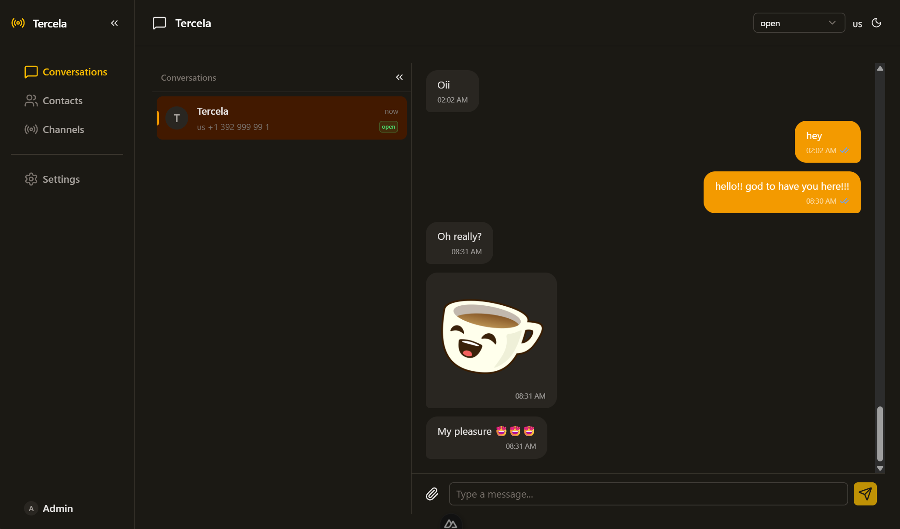

<div align="center">

# Tercela

**Open-source omnichannel platform for customer communication**

Connect channels like WhatsApp, manage conversations in real time, and organize contacts — all in a unified interface.

[](https://www.gnu.org/licenses/agpl-3.0)
[](https://github.com/tags-dev/tercela)
[](https://bun.sh)
[](https://hono.dev)
[](https://nuxt.com)
[](https://www.postgresql.org)
[](https://orm.drizzle.team)



[Features](#features) · [Quick Start](#quick-start) · [API Docs](#api-reference) · [Contributing](CONTRIBUTING.md) · [Roadmap](#roadmap)

</div>

---

## Features

### Messaging

- **Omnichannel inbox** — Manage all conversations from a single dashboard
- **WhatsApp integration** — Send and receive messages via WhatsApp Cloud API
- **Real-time updates** — WebSocket-powered live messaging
- **Message templates** — Create, edit and sync WhatsApp message templates with Meta
- **Media support** — S3-compatible storage for images, audio, video and documents

### Management

- **Contact management** — Centralized contact database with metadata
- **Agent assignment** — Route conversations to team members
- **Channel adapter pattern** — Extensible architecture to add new channels

### Developer Experience

- **REST API with OpenAPI docs** — Interactive API reference via Scalar
- **Automatic migrations** — Versioned database migrations applied on boot
- **Docker-ready** — One command to run the entire stack
- **Monorepo** — Clean separation of API, frontend and shared packages

## Tech Stack

| Layer | Technology |
|-------|-----------|
| Backend | [Hono](https://hono.dev) + [Bun](https://bun.sh) |
| Frontend | [Nuxt 4](https://nuxt.com) + [Nuxt UI](https://ui.nuxt.com) |
| Database | PostgreSQL + [Drizzle ORM](https://orm.drizzle.team) |
| Real-time | Bun native WebSocket |
| Auth | JWT (HS256) |

## Quick Start

### With Docker (fastest)

```bash
git clone https://github.com/tags-dev/tercela.git
cd tercela
cp .env.example .env
docker compose up -d
```

### Without Docker

```bash
git clone https://github.com/tags-dev/tercela.git
cd tercela
bun install
cp .env.example .env    # edit with your DATABASE_URL and JWT_SECRET
bun run dev
```

Open **http://localhost:3000** — API docs at **http://localhost:3333/reference**.

**Default login:** `admin@tercela.com` / `admin123` — change immediately in production.

## Scripts

| Command | Description |
|---|---|
| `bun run dev` | Start API + Web in dev mode |
| `bun run dev:api` | Start API only |
| `bun run dev:web` | Start frontend only |
| `bun run db:generate` | Generate migration from schema changes |
| `bun run db:migrate` | Apply pending migrations |
| `bun run db:seed` | Seed database with initial data |
| `bun run docker:up` | Start all services via Docker |
| `bun run docker:down` | Stop Docker services |

## API Reference

With the server running, open **http://localhost:3333/reference** for the interactive API documentation powered by [Scalar](https://scalar.com).

## Project Structure

```
tercela/
├── apps/
│   ├── api/            # Hono + Bun REST API (port 3333)
│   │   ├── src/
│   │   │   ├── routes/       # API endpoints
│   │   │   ├── services/     # Business logic
│   │   │   ├── channels/     # Channel adapters (WhatsApp, ...)
│   │   │   ├── db/           # Drizzle schema & migrations
│   │   │   ├── middleware/    # Auth & error handling
│   │   │   └── ws/           # WebSocket handlers
│   │   └── Dockerfile
│   └── web/            # Nuxt 4 frontend (port 3000)
│       ├── app/
│       │   ├── pages/        # Application routes
│       │   ├── components/   # Vue components
│       │   └── layouts/      # Layout wrappers
│       └── Dockerfile
├── packages/
│   └── shared/         # Shared types, constants & utilities
├── docker-compose.yml
├── .env.example
└── package.json
```

<details>
<summary><strong>Database Schemas</strong></summary>

Tables are organized into named PostgreSQL schemas:

| Schema | Tables | Purpose |
|---|---|---|
| `auth` | users | Authentication & user management |
| `channels` | channels, templates | Communication channels & WhatsApp templates |
| `contacts` | contacts | Contact database |
| `inbox` | conversations, messages, conversation_reads | Conversation and message data |
| `config` | settings | Application settings |
| `storage` | media | Media file references |

</details>

<details>
<summary><strong>Environment Variables</strong></summary>

| Variable | Description | Default |
|---|---|---|
| `DATABASE_URL` | PostgreSQL connection string | — |
| `JWT_SECRET` | Secret key for JWT signing | — |
| `API_PORT` | API server port | `3333` |
| `WHATSAPP_VERIFY_TOKEN` | WhatsApp webhook verification token | — |
| `WHATSAPP_ACCESS_TOKEN` | WhatsApp Cloud API access token | — |
| `WHATSAPP_PHONE_NUMBER_ID` | WhatsApp phone number ID | — |

</details>

## Roadmap

- [ ] AI / Chatbot support
- [ ] Multi-language dashboard
- [ ] Webchat widget (embed on any website)
- [ ] Analytics dashboard
- [ ] Email channel

Have an idea? [Open a feature request](https://github.com/tags-dev/tercela/issues/new?template=feature_request.yml).

## Contributing

Contributions are welcome! Check out the [Contributing Guide](.github/CONTRIBUTING.md) to get started.

Whether it's a bug fix, new feature, or documentation improvement — every contribution matters.

## License

This project is licensed under the [GNU Affero General Public License v3.0](LICENSE). See [NOTICE](NOTICE) for attribution details.

---

<div align="center">

If Tercela is useful to you, consider giving it a :star: — it helps others discover the project!

</div>
